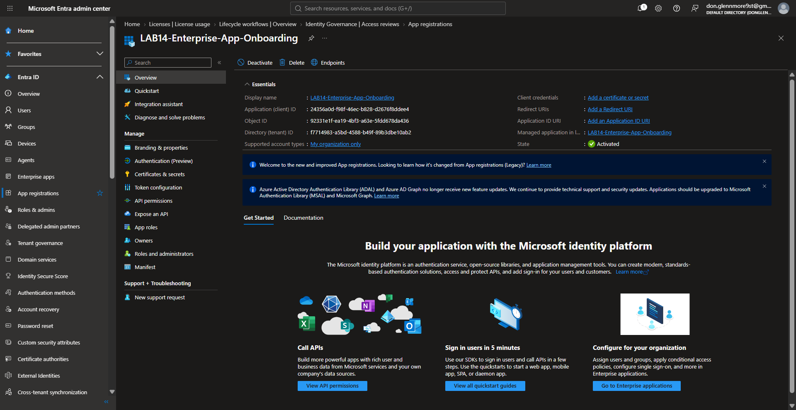
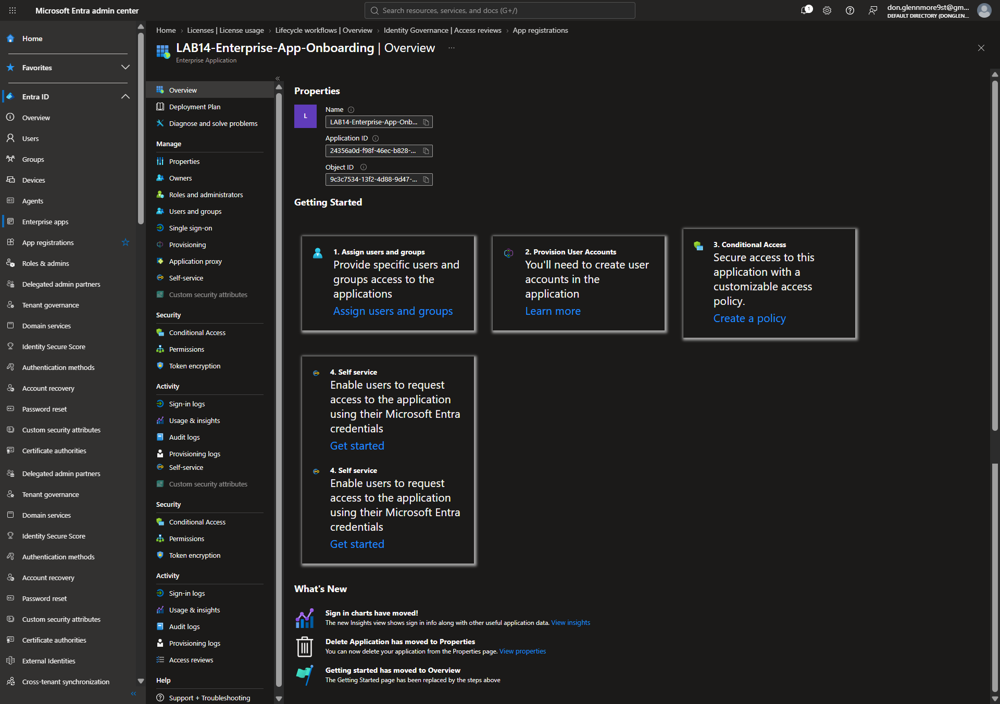
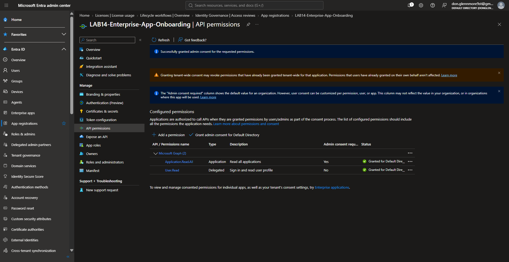
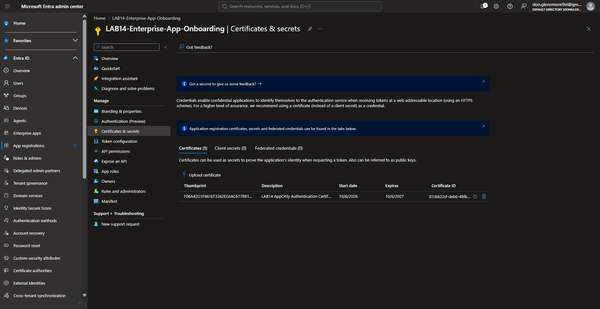
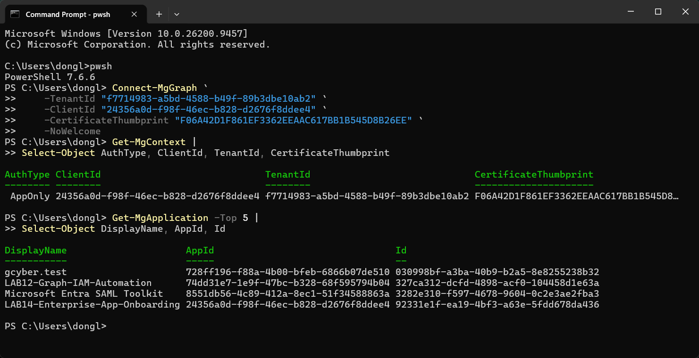

## Evidence Gallery

### 1. Created the Microsoft Entra App Registration
Created a dedicated Microsoft Entra application registration for the enterprise app onboarding lab.

---

### 2. Validated the Enterprise Application / Service Principal
Confirmed that the App Registration created a corresponding Enterprise Application / Service Principal inside the tenant.

---

### 3. Configured Microsoft Graph Application Permission and Granted Admin Consent
Added the `Application.Read.All` application permission and granted tenant-wide administrator consent for the workload identity.

---

### 4. Registered the X.509 Certificate Credential in Microsoft Entra
Uploaded and registered the public X.509 certificate used by the application for certificate-based AppOnly authentication.

---

### 5. Verified Certificate-Based AppOnly Authentication and Functional Microsoft Graph Access
Authenticated to Microsoft Graph as the application using the certificate and successfully retrieved Microsoft Entra application objects with `Get-MgApplication`.

This confirms the full working chain:

`App Registration → Service Principal → Certificate Credential → Application Permission → Admin Consent → AppOnly Authentication → Microsoft Graph Read`

## Security Concepts Demonstrated

- Workload identity
- Microsoft Entra App Registration
- Enterprise Application / Service Principal
- Application permissions
- Administrator consent
- X.509 certificate-based authentication
- AppOnly authentication
- Least privilege
- Microsoft Graph authorization
- Functional access validation

## SCIM Provisioning Assessment

SCIM provisioning was assessed as part of the enterprise application onboarding workflow.

The custom lab application did not provide a legitimate external SCIM endpoint or target SaaS environment. Because of this, hands-on SCIM provisioning was not performed.

This limitation was documented rather than simulating or claiming unsupported provisioning activity.

## Key Result

Successfully configured and validated a Microsoft Entra workload identity using:

- App Registration
- Service Principal
- Microsoft Graph `Application.Read.All`
- Administrator consent
- X.509 certificate credential
- Certificate-based AppOnly authentication
- Functional Microsoft Graph access

The workload identity successfully retrieved Microsoft Entra application objects through Microsoft Graph.

## Tools Used

- Microsoft Entra ID
- Microsoft Graph
- Microsoft Graph PowerShell SDK
- PowerShell 7
- X.509 certificates

## Portfolio Scope

This project demonstrates hands-on enterprise application onboarding and workload identity validation.

SCIM provisioning was assessed, but is not claimed as hands-on provisioning experience because a legitimate SCIM target environment was not available.
